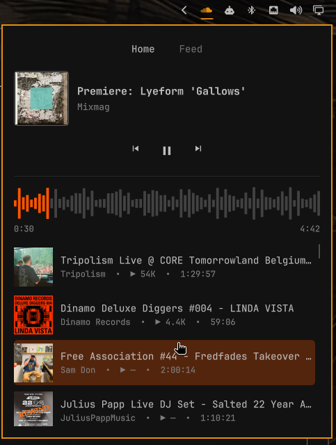
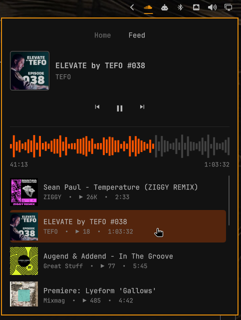

# Omarchy SoundCloud

SoundCloud playback and browsing in the Omarchy top bar, without a browser tab and
without official SoundCloud API credentials.

<p>
  
  
</p>

## Features

- Current track, artist, and artwork, with the bar icon highlighted during playback
- Play/pause, previous, and next controls
- SoundCloud-style waveform progress display with click-to-seek
- Heart button to like or unlike the current track on your SoundCloud account
- Home and Feed tabs that load more tracks as you scroll
- Persistent SoundCloud login session
- Local audio playback through GStreamer

## Requirements

- Omarchy 4 with `omarchy-shell`
- Python 3 with PyGObject
- GTK 3, WebKitGTK 4.1, and libsoup 3
- `gst-plugins-good` (provides WebKitGTK's required `autoaudiosink`)
- `gst-libav` (provides AAC decoding for current SoundCloud HLS streams)

A stock Omarchy install includes everything except the two GStreamer plugins.
Install them if needed:

```sh
omarchy pkg add gst-plugins-good gst-libav
```

If a dependency is missing, the popup names the packages to install instead of
connecting. To verify all runtime dependencies from a terminal:

```sh
python3 soundcloud_app.py check
```

## Install

```sh
omarchy plugin add https://github.com/brunossilveira/omarchy-plugin-soundcloud.git --enable
```

The widget appears in the right section of the top bar. Open or close its popup
from a keybinding or script with:

```sh
omarchy-shell shell toggle brunosilveira.soundcloud
```

## First sign-in

1. Click the SoundCloud icon in the top bar.
2. Select `Connect`.
3. Select `Show SoundCloud sign in`.
4. Sign in inside the SoundCloud window.
5. Close the window after the account page loads.

You only need to sign in once. Closing the window hides it; the playback backend
keeps running.

## Controls

- Click: open or close the popup
- Middle-click: play/pause
- Right-click: next track
- Mouse wheel: previous/next
- Popup: artwork, metadata, playback controls, and a seekable waveform
- Home and Feed tabs: click a track to play it

## Troubleshooting

- The popup reports missing packages: install them with the `omarchy pkg add`
  command it shows, then select Connect again.
- Nothing plays: run `python3 soundcloud_app.py check` and install any missing
  GStreamer plugins.
- The heart opens the SoundCloud window: SoundCloud's bot protection wants a
  captcha. Solve it in that window, close it, then tap the heart again.
- Lists or playback stop working: SoundCloud may have changed its private web API.
  Stop the backend with `python3 soundcloud_app.py stop` and open the popup again
  to relaunch it. If that does not help, please open an issue.
- Some tracks never play: tracks blocked for off-platform or regional playback keep
  SoundCloud's normal restrictions.

## Removing

To keep the local SoundCloud session for a later reinstall, remove the plugin with:

```sh
omarchy plugin remove brunosilveira.soundcloud
```

The backend watches the installed plugin path, shuts down when it disappears,
and removes its runtime socket. These owner-only files in
`~/.local/share/omarchy-soundcloud/` are intentionally kept so reinstalling does
not require another sign-in:

- `cookies.json`: the SoundCloud session cookies
- `tracks.json`: the cached Home and Feed track lists (titles, artists, links)

The runtime directory `$XDG_RUNTIME_DIR/omarchy-soundcloud/` (lock file and the
optional `pagination.log`) is also kept until logout.

To remove persistent state too, run these commands in this order while the plugin
is still installed:

```sh
python3 soundcloud_app.py stop
rm -r -- ~/.local/share/omarchy-soundcloud ~/.cache/omarchy-soundcloud
omarchy plugin remove brunosilveira.soundcloud
```

## Limitations

SoundCloud requires Artist Pro to issue official API credentials, so this plugin uses
the authenticated web app's private JSON APIs through an isolated WebKit view.
Selecting a track resolves its stable track ID to a short-lived media URL for the
local GStreamer player. These private API schemas can change without notice.

## How it works

A hidden, sandboxed WebKitGTK view stays signed in to soundcloud.com. The backend
reads the SoundCloud web app's own API responses to build the Home and Feed lists
and to resolve stream URLs, then plays the audio locally with GStreamer. The bar
widget talks to the backend over a private Unix socket.

- The backend (`soundcloud_app.py`) starts only when you interact with the widget.
  When the shell starts, the widget only looks for a running backend, so playback
  survives shell restarts.
- The backend stops when the plugin is removed, or 10 seconds after the bar widget
  disconnects.
- Home and Feed are built from the SoundCloud page's own API responses and
  paginated through SoundCloud's API cursors. Each list keeps at most 100 tracks
  and is cached so the popup has content right after a restart.
- Selecting a track resolves it to a short-lived stream URL inside the WebKit view.
  The backend then plays it with GStreamer, directly for progressive streams and
  through a bounded segment fetcher for HLS. A track that does not resolve within
  15 seconds shows an error.
- Play/pause and seek control GStreamer when it is playing. Otherwise they, and
  previous/next, control SoundCloud's own web player.
- On Hyprland the backend sets `WEBKIT_DISABLE_DMABUF_RENDERER=1` to avoid
  WebKitGTK rendering crashes.

## Privacy and security

- Network endpoints: the hidden WebKit view loads the `soundcloud.com` web app,
  which makes its own `api-v2.soundcloud.com` calls and loads whatever
  subresources (scripts, images, analytics) SoundCloud's page includes. Top-level
  navigation is limited to `soundcloud.com` hosts. The Python backend itself
  fetches audio only from `*.sndcdn.com` and `*.soundcloud.cloud` and artwork only
  from `i1.sndcdn.com`, over HTTPS.
- WebKit uses an ephemeral in-memory profile and cache; it is never given a
  pathname to reopen for session storage.
- The session survives restarts through a bounded, owner-only cookie jar in
  `~/.local/share/omarchy-soundcloud/`. The account password is never stored.
- SoundCloud's request authorization headers stay inside the WebKit view. They
  are never passed to the backend, logged, or written to disk.
- Artwork is downloaded only from SoundCloud's `i1.sndcdn.com` CDN through a
  bounded HTTPS fetcher, validated as PNG or JPEG, and passed to the shell as
  bounded image data.
- The bar connects to the backend over a mode-0600 Unix socket in the owner-only
  `$XDG_RUNTIME_DIR/omarchy-soundcloud/` directory. The backend checks each
  client's Unix peer credentials. Status is pushed over that connection, so normal
  controls do not launch a new Python process.

## Backend CLI

```sh
python3 soundcloud_app.py check        # check runtime dependencies (JSON)
python3 soundcloud_app.py launch       # start the backend and show the sign-in window
python3 soundcloud_app.py status
python3 soundcloud_app.py play-pause
python3 soundcloud_app.py previous
python3 soundcloud_app.py next
python3 soundcloud_app.py seek 0.5     # seek to 50%
python3 soundcloud_app.py play soundcloud:tracks:123456
python3 soundcloud_app.py show         # show the SoundCloud window
python3 soundcloud_app.py stop
```

## Install for development

```sh
ln -s "$PWD" ~/.config/omarchy/plugins/brunosilveira.soundcloud
omarchy-shell shell rescanPlugins
omarchy plugin enable brunosilveira.soundcloud --before omarchy.tray
```

The widget appears in the right section of the top bar, immediately before the system tray.

## Development

```sh
python3 -m unittest tests/test_soundcloud_app.py -v
node tests/test_soundcloud_model.js
omarchy plugin validate .
```

The Python tests need `node`, which runs the injected page scripts. They do not
need GTK or a display.

- QML changes take effect after `omarchy-restart-shell`.
- Python changes take effect after `python3 soundcloud_app.py stop` and relaunching
  the backend from the bar.

## License

MIT. See [LICENSE](LICENSE).
